# Realtime Engagement System

This is a historical implementation snapshot kept for context.

It is not a current architecture source of truth. The flow below still helps
explain older Discord-side engagement work, but it references module names from
an earlier runtime shape and should not be used to infer today's planner or
provider boundaries without re-validation.

## Purpose

The realtime engagement loop provides a context-aware flow that stays quiet when appropriate and uses recent channel state to decide whether to reply.

## Current Flow

```mermaid
flowchart LR
    DiscordEvent["Discord messageCreate"]
    MessageCreate["MessageCreate.ts"]
    Catchup["CatchupFilter.ts"]
    Context["ChannelContextManager"]
    Filter["RealtimeEngagementFilter"]
    Planner["Planner.ts"]
    OpenAI["OpenAIService.ts"]
    Response["ResponseHandler.ts"]

    DiscordEvent --> MessageCreate
    MessageCreate --> Catchup
    Catchup -->|skip| MessageCreate
    Catchup -->|continue| Context
    Context --> Filter
    Filter -->|should respond| Planner --> OpenAI --> Response
```

---

## CatchupFilter

**Goal:** Keep low-signal chatter away from the planner.  
**Notes:**

- Implemented in `packages/discord-bot/src/utils/CatchupFilter.ts`.
- Returns `{ skip, reason }` and biases toward “let the planner decide.”
- Wired into `packages/discord-bot/src/events/MessageCreate.ts`.

---

## ChannelContextManager

**Goal:** Maintain short-term channel/thread memory and metrics.  
**Notes:**

- Implemented in `packages/discord-bot/src/state/ChannelContextManager.ts`.
- Feature flag: `CONTEXT_MANAGER_ENABLED`.
- Provides `recordMessage`, `getRecentMessages`, `evictExpired`, `resetChannel`.
- Structured logs emitted: `context_message_recorded`, `context_state`, `context_eviction`, `context_channel_reset`.
- Automatic eviction prevents memory leaks (default 5 minutes).
- Legacy counters remain available for compatibility.

---

## RealtimeEngagementFilter

**Goal:** Decide whether the bot should respond based on weighted engagement signals.  
**Notes:**

- Implemented in `packages/discord-bot/src/engagement/RealtimeEngagementFilter.ts`.
- Feature flag: `REALTIME_FILTER_ENABLED`.
- Inputs include mentions, questions, technical keywords, human activity, and bot noise.
- Optional reaction mode to acknowledge skips.
- CatchupFilter remains as fallback when the realtime filter is disabled.
- Structured logs emitted: `engagement_decision`.
